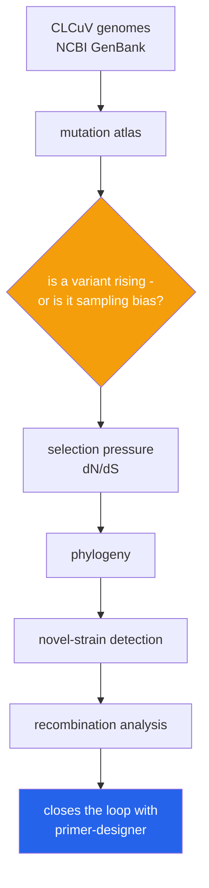

<h1 align="center">clcuv-surveillance (Python · pairwise alignment · dN/dS · UPGMA phylogeny)</h1>
<p align="center"><i>Which variant is winning, why, and whether our diagnostics can still see it</i></p>

<p align="center">
  <a href="#what-it-does">What it does</a> &middot;
  <a href="#1-which-variant-is-rising--and-is-that-real">Which variant is rising</a> &middot;
  <a href="#2-is-something-selecting-for-it">Selection pressure</a> &middot;
  <a href="#3-how-are-the-strains-related">Phylogeny</a> &middot;
  <a href="#4-is-this-something-we-have-never-seen">Novel strains</a> 
</p>

<p align="center">
  <a href="https://github.com/hammasbuilds/clcuv-surveillance/actions/workflows/ci.yml"></a>
  
  
  
  <a href="LICENSE"></a>
</p>

---

## What it does



**"Is that real, or is it sampling bias?"** is the first question, not the last. A variant
appearing more often in a database may only mean someone sequenced more of it.


Cotton Leaf Curl Virus is the most serious threat to Punjab's cotton crop.
Resistance-breaking strains have already defeated resistant cultivars **and** the PCR
primers used to detect them — a field can test clean while the crop fails.

Surveillance has to answer four questions, and each one has a way of being answered
wrongly that is worse than not answering it at all.

## 1. Which variant is rising — and is that real?

A mutation sitting at 40% for three seasons is background. One that went 2% → 8% → 25%
is a lineage winning, and worth knowing about **while it is still at 25%**. So the atlas
is built around trajectories, and alerting is on the derivative rather than the level.

Getting that question wrong is easy, and it is wrong in three different ways. **Each of
the three controls below was added because it caught a false positive that the previous
two let through**, and the last two were found on real GenBank data rather than imagined.

### Control 1 — effect size is not evidence

Two seasons of 100 genomes can differ by ten points with nothing happening at all. A
variant held at a constant 40% was reported as rising because two samples happened to
land at 33% and 45%. A two-proportion z-test runs alongside the effect-size threshold:

```python
assert emerging_variants(variants) == []        # z below 1.96
assert emerging_variants(variants, min_z=0.0)   # effect size alone would have fired
```

Periods with too few sequences are excluded outright — a variant at "100%" in a period
where three genomes were sequenced is not at 100%, it is unmeasured. Fold change from
zero is reported as `None`, because *"newly detected"* and *"exploding"* are different
claims.

### Control 2 — compared with what? (`stratify=True`)

In the real GenBank set, 2019 submissions are Punjab-only and 2021 adds Sindh and India.
A variant common in Sindh and absent from Punjab then **appears to emerge** between 2019
and 2021, with a perfectly valid z-statistic, having done nothing at all. The frequency
genuinely rose. The population being sampled is not the same population.

So the rise is re-tested inside each location separately, comparing like with like -
after merging the spellings of one place first (`Pakistan: Punjab`, `Pakistan: Punjab
province`, `Pakistan: Punjab,Bahawalpur` and three more are one stratum, not six; see
`clcuv.geo`). On the real data this removed 16 of 92.

### Control 3 — how many independent genomes is that? (`collapse_clonal`)

The remaining 76 are "confirmed" somewhere, most of them Punjab, at z > 3. Then:

```
2019  Pakistan: Punjab   8 sequences ->  3 haplotypes   (x2.67)
2021  Pakistan: Punjab   8 sequences ->  1 haplotype    (x8.0)   <- all 28 pairs identical
2021  Pakistan: Sindh    5 sequences ->  1 haplotype    (x5.0)
```

Each year's Punjab sample is one submission batch, and the 2021 batch is **clonal** —
28 of 28 pairs 100% identical. The z-test was told there were sixteen independent
observations. There were two. Collapsing each `(year, location)` to one sequence per
haplotype first:

```
all sequences        n=228  pooled=92  stratified=76
one per haplotype    n=184  pooled= 0   stratified=0
```

**Seventy-six to zero.** This is the same bug as a research agent counting one wire story
republished by twelve outlets as twelve corroborating sources: *the unit of replication
is not the row*. Identical sequences in **different** places or years are kept — that is
spread, not duplication.

Reproduce all of it, from NCBI, in one command:

```bash
uv run python scripts/real_data.py analyse
```

The honest output on this dataset is that **no variant can be shown to be emerging**.
This query returns 254 genomes, which deduplicate to 184 haplotypes across 67 strata once
location spellings are merged - and after that, not enough independent genomes from any
single place and pair of years to support the claim. A surveillance tool that says so is
more useful than one that reports 76.

The count that survives stratification moves with the corpus and with `min_samples` - the
CLI's `analyse` command prints the sweep across a range of thresholds alongside the
headline number for exactly this reason. What does not move is the ending: every rerun
of this dataset has collapsed to zero independent genomes.

## 2. Is something selecting for it?

Every virus is always changing. The question is whether anything is **rewarding** the
change.

```
dN/dS < 1    purifying — the protein is constrained
dN/dS ≈ 1    neutral drift
dN/dS > 1    positive selection — something is rewarding change
```

For a plant virus under host-resistance pressure, dN/dS > 1 in the coat protein is the
signature of a strain learning to break resistance. It is **invisible if you only count
mutations**: a region can mutate fast and be under strong purifying selection at the
same time.

Nei-Gojobori counting, implemented directly. When there are no synonymous differences
the ratio is `None` — reporting infinity would turn *"we cannot tell"* into *"strong
positive selection"*, which is the wrong direction to be wrong in for an alert.

## 3. How are the strains related?

**Neighbour-joining, not UPGMA — and the difference is the point.**

UPGMA assumes a molecular clock: every lineage evolving at the same rate. Real viral
lineages do not, and the one under resistance pressure evolves *fastest* — which is
precisely the lineage surveillance cares about. UPGMA places it wrongly, and does so
confidently.

Both are implemented, and the comparison is a test on an exact additive matrix where
the true tree is known:

```python
def test_neighbour_joining_recovers_the_true_branch_lengths():
    assert lengths == pytest.approx({"A": 5.0, "B": 2.0, "C": 2.0, "D": 3.0})

def test_upgma_gets_it_wrong_when_rates_differ():
    assert not TRUTH <= clades(upgma(NAMES, MATRIX))

def test_upgma_is_correct_when_the_clock_holds():
    ...   # it is not a broken method, it is a method with an assumption
```

Distances use **Jukes-Cantor**, because counting differences undercounts divergence —
the same site can mutate twice and the second change hides the first. At 5% divergence
that hardly matters; begomoviruses routinely reach 30%. At p ≥ 0.75 the distance is
`inf`, not a large number: the sequences are statistically indistinguishable from
random and the honest statement is that it cannot be estimated.

## 4. Is this something we have never seen?

**A classifier that must choose will assign a novel recombinant to whichever strain it
resembles least-badly — and report it with the same confidence as a real match.** For
surveillance that is the worst possible failure, because the novel strain is the one the
system exists to find.

So classification returns `None` above a distance threshold, calibrated from each
strain's own internal spread. An unassigned genome is a **finding**, not a gap:

```python
{"strain": None, "novel": True,
 "reason": "distance 0.8602 exceeds the threshold 0.0500 for its nearest strain Burewala"}
```

A small margin between the top two strains is also flagged — a genome sitting between
two lineages is not a tie to be broken, it is the answer.

k-mer profiles rather than alignment, because a recombinant whose segments come from two
parents has **no single good alignment** — exactly the case where an alignment-based
classifier degrades silently.

### Recombination is detected as a switch, not a distance

A point mutation shifts similarity to both parents a little. Recombination **moves a
block**: similarity to one parent rises while similarity to the other falls, at a
specific coordinate. Detecting the switch is what separates a recombinant from a merely
divergent isolate — and recombination is how begomoviruses acquire resistance-breaking
traits wholesale rather than one mutation at a time.

## It closes the loop with primer-designer

The mutation atlas feeds
[`primer-designer`](https://github.com/hammasbuilds/primer-designer) directly:

> **This one finds the virus escaping. That one tells you whether your test can still
> see it, and designs a replacement.**

An emerging variant under a primer binding site is a primer-health alert waiting to
happen, and a 3′-terminal mismatch there means the assay goes blind while still
reporting cleanly.

`scripts/export_alignment.py` is the actual handover — it writes the aligned set as FASTA
with its provenance in the header, and that file is committed *there* as input data rather
than the two repositories sharing a runtime dependency:

```bash
uv run python scripts/export_alignment.py ../primer-designer/data/clcuv_aligned.fasta
```

It exports **one sequence per haplotype, not one per record**, which is the same collapse
the emergence controls rest on. Conservation counted across clonal duplicates would let a
single 2021 Punjab submission of eight identical genomes vote eight times on how safe a
site is, and a primer designed against that number has been told the site is more conserved
than the evidence supports. 250 records, 210 haplotypes.

---

## Input

GenBank records as NCBI serves them — `data/clcuv.gb`, committed, 254 of them. The three
fields that make a record surveillance data rather than a sequence are the organism, the
place and the date:

```
LOCUS       PZ547674                2739 bp    DNA     linear   VRL 02-SEP-2026
  ORGANISM  Cotton leaf curl Multan virus
     source          1..2739
                     /host="cotton"
                     /geo_loc_name="India"
                     /collection_date="21-Aug-2022"
ORIGIN
        1 accggatggc cgcgcgattt ttttgtgggc ccccgattta tgagattgct ccctcaaagc
       61 taaataacgc tcccgcacac tataagtact tgcgcactaa gtttcaaatt caaacatgtg
```

`collection_date` arrives as `2019`, `May-2019`, `01-May-2019` and `2015-01` in this one
file; `geo_loc_name` as `Pakistan: Punjab`, `Pakistan: Punjab province` and
`Pakistan: Punjab,Bahawalpur`. Both are normalised before anything is counted. Your own
data goes in as FASTA plus a metadata CSV instead — see `clcuv analyse`.

## Output

`python demo.py` — the real output, abridged in the middle only:

```
254 records parsed
  with country : 248
  with date    : 229

250 are Cotton leaf curl Multan virus; the rest are other CLCuV species and excluded

alignment cached in clcuv_aligned.fasta.gz, reusing it
  0.1s
  {"sequences": 250, "width": 3162, "all_gap_columns": 0, "invariant_columns": 962,
   "invariant_fraction": 0.3042, "gap_fraction": 0.1335}
  consensus: 3162 bp, 449 uncalled

228 have both a year and a place, and can be surveilled

--- how many independent genomes are actually here? ---
  ...
  2019  Pakistan: Punjab                8 sequences ->  3 haplotypes  (x2.67)   <- too clonal to test
  2020  Pakistan: Punjab               13 sequences -> 11 haplotypes  (x1.18)
  2021  China: Guangdong               25 sequences -> 21 haplotypes  (x1.19)
  2021  Pakistan: Punjab                8 sequences ->  1 haplotype   (x8.0)    <- too clonal to test
  2021  Pakistan: Sindh                 5 sequences ->  1 haplotype   (x5.0)    <- too clonal to test
  ...

  {"isolates": 228, "haplotypes": 184, "inflation": 1.239, "largest_clonal_group": 8,
   "strata": 67, "worst_strata": {"2021/Pakistan: Punjab": "8 -> 1",
   "2019/Pakistan: Punjab": "8 -> 3", "2021/Pakistan: Sindh": "5 -> 1"}}

837 variants above 1% against the consensus

--- what survives each control ---
  all sequences        n=228 pooled=92  stratified=76
  one per haplotype    n=184 pooled=0   stratified=0
```

Eight genomes from Punjab in 2021 are one haplotype — the same infection sequenced eight
times. Counting them as eight independent observations is part of what makes 76
"emerging" variants survive a pooled test and a stratified one. Counting each clonal
group once produces none.

**The zero is the result.** Seventy-six variants that looked real under both tests had no
independent support at all, and the dataset cannot answer the question it was asked.

### How long it takes

Measured on an 8-core Windows laptop, CPython 3.14, while other jobs held the machine at
about 70% CPU — so these are slow-case numbers, not best-case ones:

| Command | Time | What it does |
|---|---|---|
| `python demo.py` | **31 s** | reads the committed corpus and the committed alignment |
| `python scripts/real_data.py analyse --no-cache` | **7 m - 13 m** | realigns all 250 genomes (6 m 44 s of the 7 m 04 s best case is the aligner; the same run measured 12 m 48 s against a test suite on the other cores), then the same analysis |
| `pytest -q` | 25-60 s | 231 tests |

The alignment is centre-star banded Needleman-Wunsch in pure Python with no
dependencies, which is the trade this repository makes: ~1.6 s per genome pair instead of
installing MAFFT. Because the committed corpus never changes, its alignment is committed
too (`data/clcuv_aligned.fasta.gz`, 24 KB) and reused — keyed by a digest of the input
sequences and then verified row by row against them, so a stale cache is a cache miss
rather than a wrong answer. `--no-cache` always does the full computation, and both paths
print the same numbers.

---

## Tests

**231 tests. No dependencies, no sequence downloads, no BLAST.**

Phylogenetics and selection are exact — an additive matrix has one correct tree, and
dN/dS on synonymous-only changes is zero — so those are asserted rather than
approximated.

| Covered | |
|---|---|
| Genetic code | all 64 codons, translation, stop handling, partial codons dropped not padded |
| Selection | Met/Trp have no synonymous sites, fourfold degeneracy, synonymous-only = 0, undetermined ≠ infinite, multi-substitution averaging |
| Distance | gaps as missing data, Jukes-Cantor magnitude, saturation to `inf`, matrix symmetry |
| Trees | **NJ recovers exact topology and branch lengths**, **UPGMA fails off-clock**, UPGMA correct on-clock, Newick output |
| Atlas | variant naming, singleton removal, rising detected, **sampling noise rejected**, small periods excluded, fold from zero |
| Geography | spread vs concentration, Herfindahl index |
| Classification | known assigned, **novel refused**, unfitted refuses, length-invariant distance |
| Recombination | block swap and breakpoint located, non-recombinant clean |
| **Alignment** | bases always recoverable, deletions gapped, insertions get separate columns, **rotated circular genomes refused**, length mismatch refused, one odd sequence tolerated |
| **Aligner speed-ups** | **the banded DP agrees with full unbanded Needleman-Wunsch** over randomised indel cases, the identical-sequence shortcut matches the full matrix, duplicates aligned once, progress reported per sequence |
| **Alignment cache** | round-trips, misses on a different or reordered corpus, **rejects rows that are not the sequences they claim**, ragged rows refused, corrupt file is a miss not a crash, `--no-cache` realigns and does not overwrite |
| **Clonality** | clonal batch collapses to one, distinct sequences survive, identical sequences in different places/years kept, ambiguity skipped, **the false positive reproduced then removed**, a rise with real support kept |
| **Stratification** | the geographic confounder reproduced, then discarded; a within-location rise confirmed; one-period locations confirm nothing |
| **Geo normalisation** | spelling/casing/district variants merge to one stratum, a designed reference mismatch is not reported as a mutation |
| **I/O** | FASTA parse errors (duplicate name, non-nucleotide, gaps where unaligned expected), GenBank date formats, metadata column aliases, round-trip write |
| **CLI** | end-to-end on a user's own FASTA + metadata, JSON output, missing/empty file and bad-metadata errors are messages, not tracebacks |

## Limits

- **The aligner is narrow.** `align.py` is banded centre-star, correct for closely
  related, co-oriented, similar-length genomes — which is what GenBank begomovirus
  submissions are. It is checked rather than assumed: `check_comparable()` refuses
  differently rotated circular genomes, because a naive alignment of two rotations of
  the same genome looks fine and is meaningless. For anything divergent, use MAFFT.
- Jukes-Cantor assumes equal base frequencies and equal substitution rates. Kimura
  two-parameter or GTR fit real data better; JC is the one you can read in four lines.
- Neighbour-joining is distance-based. Maximum likelihood and Bayesian inference are
  more accurate and need a substitution model, an optimiser, and far more compute.
- Recombination detection compares against **two named parents**. Screening all pairs in
  a population is the real task, and it is combinatorially larger.
- dN/dS is pairwise Nei-Gojobori. Site-specific and branch-specific selection need a
  phylogeny and a codon model.
- **Clonal collapse is a blunt instrument.** One sequence per haplotype per
  `(year, location)` is the right correction when duplication comes from resampling one
  field; it under-counts when a lineage has genuinely swept and every genome is
  identical *because* of that. Distinguishing the two needs sampling metadata GenBank
  does not carry, so the tool reports both numbers rather than choosing.
- **The real-data conclusion is negative.** After all three controls, no variant in the
  250 public CLCuMuV genomes can be shown to be emerging. That is a limit of the public
  data, not of the method, and it is reported rather than worked around.

## Keywords

genomic surveillance &middot; Cotton Leaf Curl Virus &middot; CLCuV &middot; begomovirus &middot; phylogenetics &middot; mutation analysis &middot; selection pressure &middot; dNdS &middot; recombination detection &middot; novel strain detection &middot; sampling bias &middot; plant pathology &middot; agricultural biotechnology &middot; NCBI GenBank &middot; bioinformatics &middot; zero dependencies

## License

MIT

---

## Run it yourself

```bash
git clone https://github.com/hammasbuilds/clcuv-surveillance
cd clcuv-surveillance

pip install -e ".[dev]"  # zero runtime dependencies; pytest/ruff for development
pytest -q                # 231 tests in 25-60s, no sequence download
python demo.py           # the whole finding on the committed corpus, ~31s, offline
```

### On your own genomes

```bash
clcuv analyse --fasta isolates.fasta --metadata isolates.csv
clcuv analyse --fasta isolates.fasta --metadata isolates.csv --json
clcuv export  --fasta isolates.fasta --metadata isolates.csv --out deduped.fasta
```

`isolates.csv` needs a name column (`name`, `accession`, `id`, ...) plus a period
(`period`, `year`, `date`, ...) and a location (`location`, `country`, `region`, ...) for
every sequence — see `clcuv analyse --help`. `analyse` prints the emergence result and the
`min_samples` sweep around it together, because a count from one setting is not a finding.

If the FASTA is **not** already aligned, the aligner runs first and that is where the time
goes: 70 unaligned 2.7 kb genomes measured **1 m 58 s** at the default `--band 120` and
**57 s** at `--band 40`, on the same loaded laptop as the numbers above, with progress on
stderr throughout. The narrower band is not free — it realigned to 2,968 columns instead
of 3,162, because a band narrower than an indel cannot place that indel. Pass sequences
that are already aligned (equal length, gaps present) and the aligner is skipped
entirely, which is the fast path for repeated analyses of the same set.

### On real genomes, in one command

```bash
uv run python scripts/real_data.py analyse
```

Downloads the Cotton leaf curl virus genomes from NCBI (cached after the first run;
currently 254 records, 250 of them CLCuMuV - the corpus grows as sequences are deposited),
aligns them, builds the atlas and runs all three controls. Standard library only —
no BLAST, no MAFFT, no API key. Abridged output:

```
254 records parsed  |  250 are Cotton leaf curl Multan virus, 228 carry a plausible date
alignment cached in clcuv_aligned.fasta.gz, reusing it  |  width 3162,
                       30.4% invariant columns, 0 all-gap columns
837 variants above 1% against the consensus

2019  Pakistan: Punjab    8 sequences ->  3 haplotypes  (x2.67)
2021  Pakistan: Punjab    8 sequences ->  1 haplotype   (x8.0)    <- too clonal to test
2021  Pakistan: Sindh     5 sequences ->  1 haplotype   (x5.0)    <- too clonal to test

all sequences        n=228  pooled=92  stratified=76
one per haplotype    n=184  pooled= 0   stratified=0
```

Add `--no-cache` to realign from scratch instead of reusing the committed alignment:
7-13 minutes rather than 31 seconds, progress on stderr while it works, and output that
is identical line for line apart from the timing - which is how the cache is checked. On your own
unaligned FASTA, `--band` is the runtime dial — the default 120 is sized for begomovirus
genomes with short indels, and a narrower band is proportionally faster but will misalign
anything with an indel wider than the band.

```python
from clcuv import Isolate, build_atlas, emerging_variants, selection_pressure
from clcuv import distance_matrix, neighbour_joining, StrainClassifier

isolates = [Isolate(name, seq, period="2026-Q1", location="Multan") for name, seq in ...]

atlas = build_atlas(isolates, reference)
for e in emerging_variants(atlas):
    print(e.summary())      # C21G: 1.0% (2024-Q1) -> 42.0% (2026-Q1), z=7.06

selection_pressure(coat_protein_a, coat_protein_b).interpretation()

names, matrix = distance_matrix(sequences, names=labels)
print(neighbour_joining(names, matrix).newick())

clf = StrainClassifier().fit(labelled_genomes)
clf.classify(new_genome)    # strain=None means "I have not seen this before"
```

Sequences must already be aligned. CLCuV genomes are public in NCBI Virus; none ship
with this repo.
